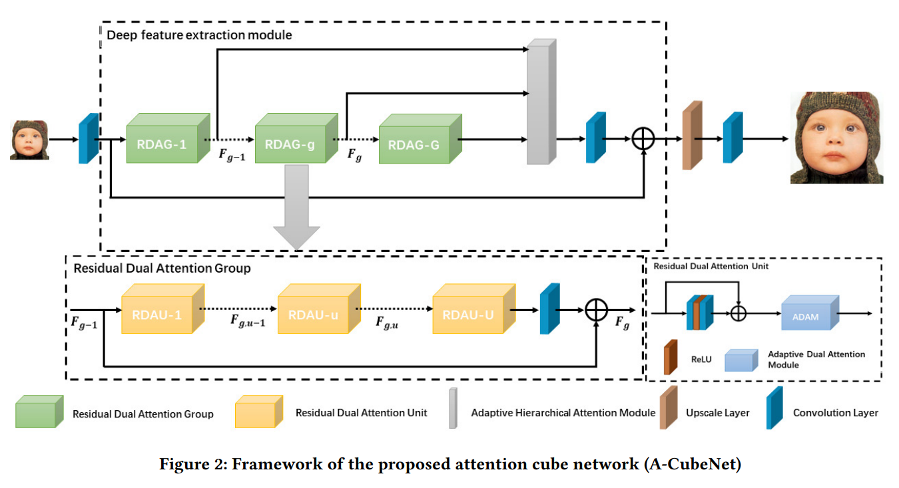
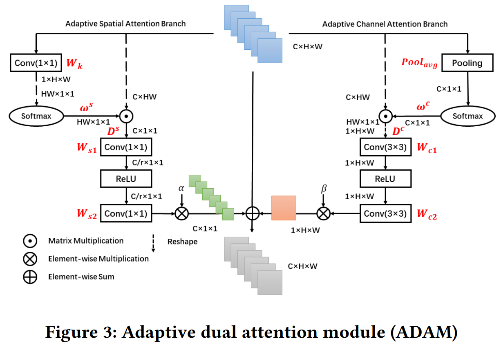
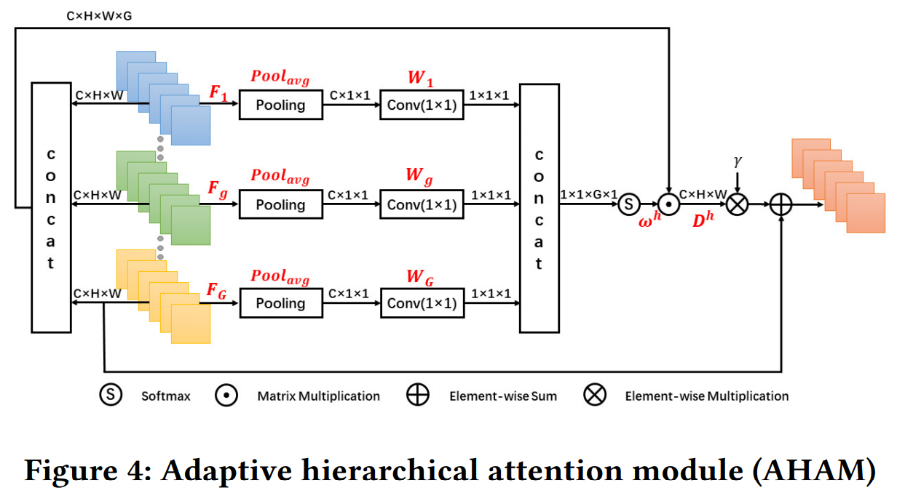
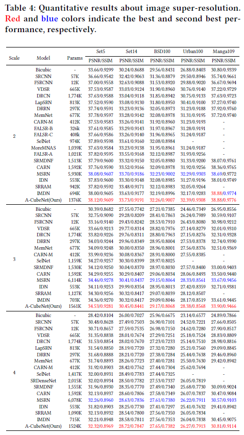
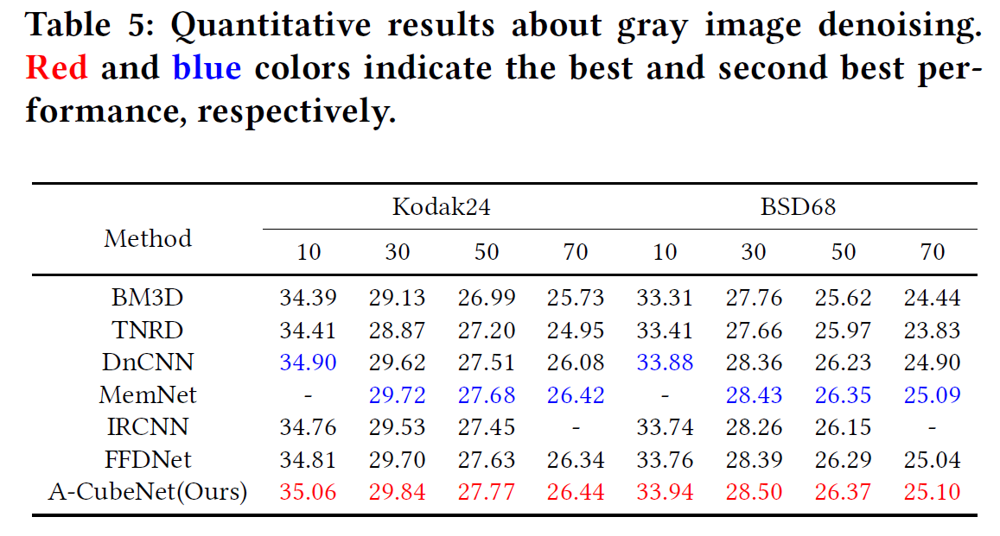
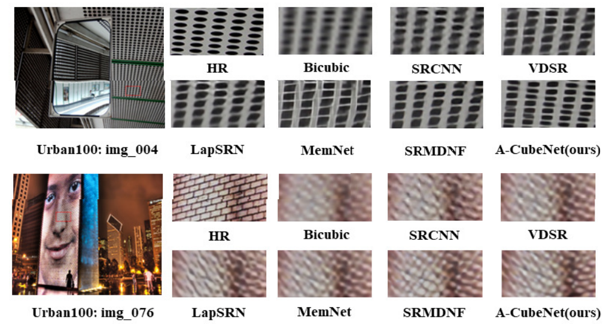
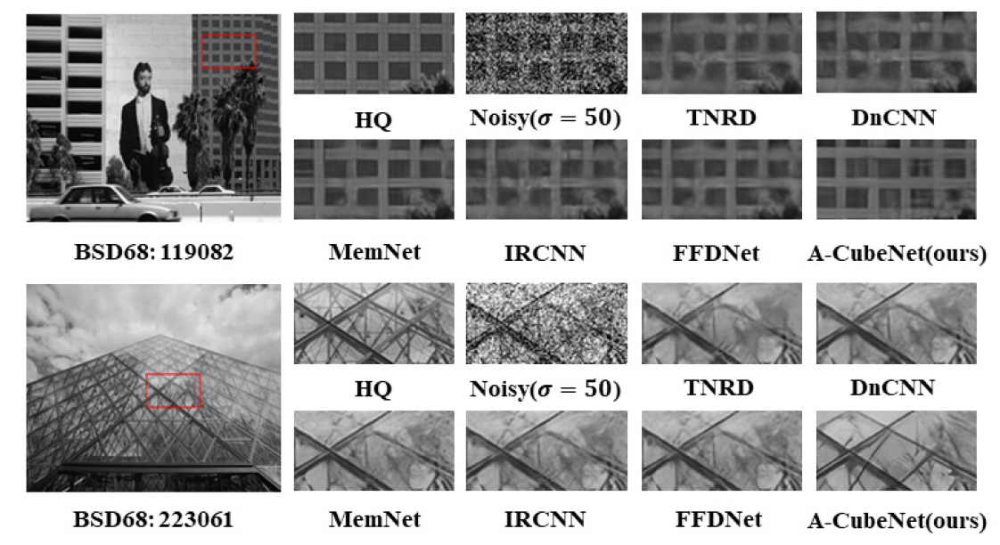
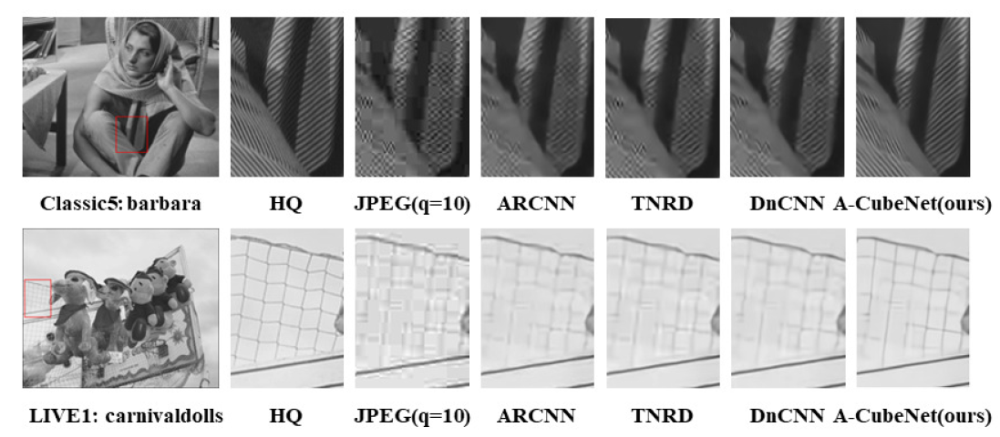

# Attention Cube Network for Image Restoration (ACM MM 2020)
[Yucheng Hang](http://ychang686.github.io/), [Qingmin Liao](https://thurid.lib.tsinghua.edu.cn/scholar/651469), [Wenming Yang](https://www.sigs.tsinghua.edu.cn/ywm/main.htm), Yupeng Chen, and [Jie Zhou](http://www.au.tsinghua.edu.cn/info/1078/1635.htm), "Attention Cube Network for Image Restoration", ACM Multimedia 2020.
[[arXiv]](https://arxiv.org/abs/2009.05907)
[[Poster]](https://github.com/YCHang686/A-CubeNet/blob/master/A-CubeNet.pdf)
[[ACM DL]](https://dl.acm.org/doi/10.1145/3394171.3413564)

The code is built on [EDSR (PyTorch)](https://github.com/thstkdgus35/EDSR-PyTorch) and tested on Ubuntu 16.04 environment (Python3.5, PyTorch_1.0.1 for DN/DB/SR) with 1080Ti GPUs.

# Hightlights
1. We propose an adaptive dual attention module (ADAM), including an adaptive spatial attention branch (ASAB) and an adaptive channel attention branch (ACAB). ADAM can capture the long-range spatial and channel-wise contextual information to expand the receptive field and distinguish different types of information for more effective feature representations. Therefore our A-CubeNet can obtain high-quality image restoration results. 

2. Inspired by the non-local neural network, we design an adaptive hierarchical attention module (AHAM), which flexibly aggregates all output feature maps together by the hierarchical attention weights depending on global context. To the best of our knowledge, this is the first time to consider aggregating output feature maps in a hierarchical attention method with global context.
<p align="center">
     <br />
</p>
<p align="center">
     <br />
</p>
<p align="center">
     <br />
</p>

## Training
* Download [Training dataset DIV2K](https://drive.google.com/open?id=12hOYsMa8t1ErKj6PZA352icsx9mz1TwB)
* Image super-resolution:
```bash
# Train_ACubeNet_SRX2, input=48x48, output=96x96
#python main.py --template ACubeNet --save ACubeNet_SRX2 --scale 2 --reset --save_results --patch_size 96
# Train_ACubeNet_SRX3, input=48x48, output=144x144
#python main.py --template ACubeNet --save ACubeNet_SRX3 --scale 3 --reset --save_results --patch_size 144 --pre_train ../experiment/ACubeNet_SRX2/model/model_best.pt
# Train_ACubeNet_SRX4, input=48x48, output=192x192
#python main.py --template ACubeNet --save ACubeNet_SRX4 --scale 4 --reset --save_results --patch_size 192 --pre_train ../experiment/ACubeNet_SRX2/model/model_best.pt

```
* Image denoising:
```bash
#Train_noise level_10
#python main.py --template ACubeNet --save ACubeNet_DN10 --reset --quality 1
#Train_noise level_30
#python main.py --template ACubeNet --save ACubeNet_DN30 --reset --quality 3
#Train_noise level_50
#python main.py --template ACubeNet --save ACubeNet_DN50 --reset --quality 5
#Train_noise level_70
#python main.py --template ACubeNet --save ACubeNet_DN70 --reset --quality 7

```
* JPEG image deblocking:
```bash
#Train_quality_10
#python main.py --template ACubeNet --save ACubeNet_DB10 --reset --quality 1
#Train_quality_20
#python main.py --template ACubeNet --save ACubeNet_DB20 --reset --quality 2
#Train_quality_30
#python main.py --template ACubeNet --save ACubeNet_DB30 --reset --quality 3
#Train_quality_40
#python main.py --template ACubeNet --save ACubeNet_DB40 --reset --quality 4

```

## Testing
* Download [Testing dataset LIVE1, Classic5, Kodak24, BSD68](https://pan.baidu.com/s/1qrj_ILqkH8N9_Y80GAKSzw) 提取码: dkxv
* Download [checkpoint](https://drive.google.com/file/d/14fqRjc4p-THgvLUJiZkLTJBpqM41kUYM/view?usp=sharing)
* Image super-resolution:
```bash
#Test_ACubeNet_SRX2, no self-ensemble
#python main.py --template ACubeNet --data_test Set5+Set14+B100+Urban100+Manga109 --scale 2 --pre_train ../experiment/ACubeNet_SRX2/model/model_best.pt --test_only --save_results
#Test_ACubeNet_SRX3, no self-ensemble
#python main.py --template ACubeNet --data_test Set5+Set14+B100+Urban100+Manga109 --scale 3 --pre_train ../experiment/ACubeNet_SRX3/model/model_best.pt --test_only --save_results
#Test_ACubeNet_SRX4, no self-ensemble
#python main.py --template ACubeNet --data_test Set5+Set14+B100+Urban100+Manga109 --scale 4 --pre_train ../experiment/ACubeNet_SRX4/model/model_best.pt --test_only --save_results

```
* Image denoising:
```bash
#Test_noise level_10
#python main.py --template ACubeNet --data_test BSD68+Kodak24 --pre_train  ../experiment/ACubeNet_DN10/model/model_best.pt --test_only --save_results --save_gt --quality 1
#Test_noise level_30
#python main.py --template ACubeNet --data_test BSD68+Kodak24 --pre_train  ../experiment/ACubeNet_DN30/model/model_best.pt --test_only --save_results --save_gt --quality 3
#Test_noise level_50
#python main.py --template ACubeNet --data_test BSD68+Kodak24 --pre_train  ../experiment/ACubeNet_DN50/model/model_best.pt --test_only --save_results --save_gt --quality 5
#Test_noise level_70
#python main.py --template ACubeNet --data_test BSD68+Kodak24 --pre_train  ../experiment/ACubeNet_DN70/model/model_best.pt --test_only --save_results --save_gt --quality 7

```
* JPEG image deblocking:
```bash
#Test_quality_10
#python main.py --template ACubeNet --data_test LIVE1+classic5 --pre_train  ../experiment/ACubeNet_DB10/model/model_best.pt --test_only --save_results --save_gt --quality 1
#Test_quality_20
#python main.py --template ACubeNet --data_test LIVE1+classic5 --pre_train  ../experiment/ACubeNet_DB20/model/model_best.pt --test_only --save_results --save_gt --quality 2
#Test_quality_30
#python main.py --template ACubeNet --data_test LIVE1+classic5 --pre_train  ../experiment/ACubeNet_DB30/model/model_best.pt --test_only --save_results --save_gt --quality 3
#Test_quality_40
#python main.py --template ACubeNet --data_test LIVE1+classic5 --pre_train  ../experiment/ACubeNet_DB40/model/model_best.pt --test_only --save_results --save_gt --quality 4

```

## Results
Quantitative Results
* Image super-resolution:
<p align="center">
     <br />
</p>

* Image denoising:
<p align="center">
     <br />
</p>

* JPEG image deblocking:
<p align="center">
     <br />
</p>

Visual Results
* Image super-resolution:
<p align="center">
     <br />
</p>

* Image denoising:
<p align="center">
     <br />
</p>

* JPEG image deblocking:
<p align="center">
     <br />
</p>

## Citation

If you find A-CubeNet useful in your research, please consider citing:

```
@inproceedings{hang2020attention,
  title={Attention Cube Network for Image Restoration},
  author={Hang, Yucheng and Liao, Qingmin and Yang, Wenming and Chen, Yupeng and Zhou, Jie},
  booktitle={Proceedings of the 28th ACM International Conference on Multimedia},
  pages={2562--2570},
  year={2020}
}

```
